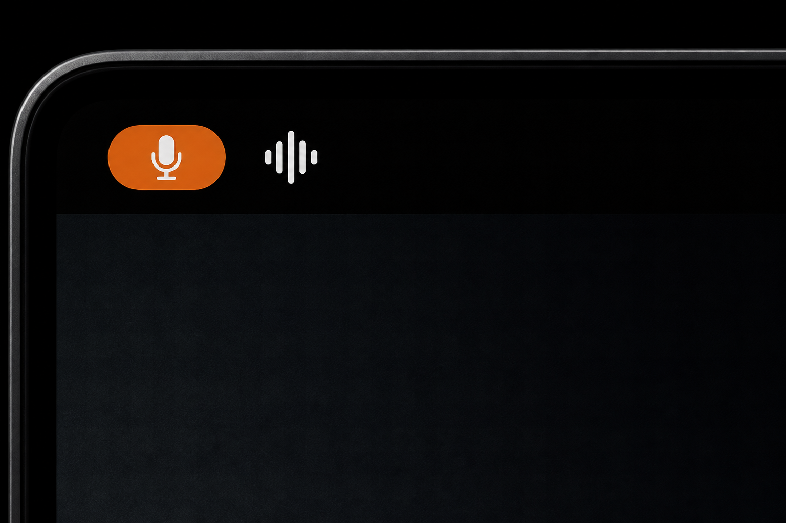

# VoiceToText

**Private local STT on your Mac.** Speech never leaves the machine. No cloud. No $20/month subscription.

<p align="center">
  
</p>



- **Option+Space** — speak, text pastes at the cursor
- **$0/month** — not SuperWhisper or cloud dictation
- **Native menu bar app** + one local Whisper process
- **Same API for agents** — OpenAI-compatible on loopback

```bash
curl -fsS http://127.0.0.1:8765/healthz
curl -fsS -F file=@sample.wav http://127.0.0.1:8765/v1/audio/transcriptions
```

Default language is Russian (`mlx_whisper.language: ru`).

---

## Quick start

Apple Silicon Mac, macOS 13+, [uv](https://docs.astral.sh/uv/).

```bash
git clone https://github.com/FUYOH666/VoiceToText.git
cd VoiceToText
uv sync
macos/scripts/build.sh
uv run python src/vtt2/main.py --install
```

That starts two LaunchAgents: `ai.vtt2.stt` (model + HTTP on `127.0.0.1:8765`) and `ai.vtt2` (Swift `VoiceToText.app`).

Grant **Microphone**, **Accessibility**, and **Input Monitoring** to **VoiceToText** — not Terminal, not python.

After an ad-hoc rebuild, macOS treats the binary as a new app: remove the old VoiceToText row in Privacy, add `macos/dist/VoiceToText.app` again, turn the toggles on.

```bash
uv run python src/vtt2/main.py --status
curl -fsS http://127.0.0.1:8765/healthz
```

---

## Deploy this for your business

Open source — run it yourself.

Or I can deploy, customize, and integrate it for your team in **2 weeks**.

**Free consultation:** [private@scanovich.ai](mailto:private@scanovich.ai) · Telegram [@ScanovichAI](https://t.me/ScanovichAI)

---

## How it works

1. Option+Space starts recording
2. Speak
3. Option+Space stops
4. The menu bar POSTs audio to local STT and pastes the text

The orange microphone pill is macOS (privacy). The waveform is VoiceToText.

Agents use the same `POST /v1/audio/transcriptions` — [docs/STT_API.md](docs/STT_API.md).

Default profile loads Whisper on demand and unloads after 15 minutes idle. Always-on: `config.resident.yaml`.

---

## Configuration (short)

```yaml
stt_server:
  host: "127.0.0.1"
  port: 8765
  engine: mlx_whisper
  preload_on_start: false
  idle_unload_seconds: 900

transcription:
  engine: local_stt
  mlx_whisper:
    model_name: "mlx-community/whisper-large-v3-mlx"
    language: "ru"
```

8 GB RAM: use `whisper-medium-mlx`. Optional remote GPU ASR via Tailscale lives under `transcription.engine: remote_asr` (keep the host in gitignored `.env.vtt2`).

---

## Troubleshooting

**Paste does nothing:** Privacy → Accessibility and Input Monitoring → **VoiceToText**. After rebuild, delete the stale row and add the current `.app`. Text is also on the clipboard (Cmd+V). Menu: «Разрешения…».

**STT slow / `readyz` 503:** idle-unload. `healthz` is enough; the next POST loads the model. Always-on: `cp config.resident.yaml config.yaml && uv run python src/vtt2/main.py --install`.

**Two menu bar icons:** `uv run python src/vtt2/main.py --install` kills leftover UI (not `--serve-stt`).

Logs: `~/Library/Logs/vtt2/` (`voicetotext.log`, `stt.stdout.log`).

---

## Development

```bash
uv run pytest
macos/scripts/test.sh
```

Notarized `.app` needs Apple Developer + `macos/Signing.xcconfig` (not in git) and `macos/scripts/release.sh`. No signed public zip is attached until a Developer ID exists.

MIT. Built with [MLX](https://github.com/ml-explore/mlx).
